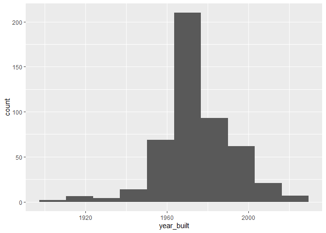
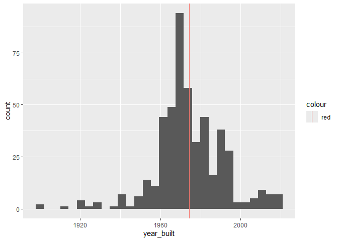
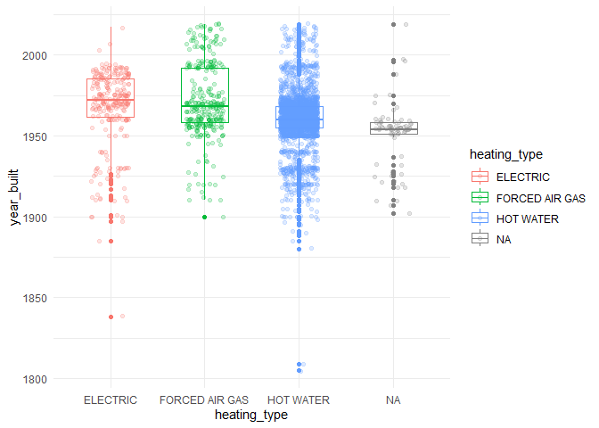

Mini Data Analysis Milestone 2
================

*To complete this milestone, you can either edit [this `.rmd`
file](https://raw.githubusercontent.com/UBC-STAT/stat545.stat.ubc.ca/master/content/mini-project/mini-project-2.Rmd)
directly. Fill in the sections that are commented out with
`<!--- start your work here--->`. When you are done, make sure to knit
to an `.md` file by changing the output in the YAML header to
`github_document`, before submitting a tagged release on canvas.*

# Welcome to the rest of your mini data analysis project!

In Milestone 1, you explored your data. and came up with research
questions. This time, we will finish up our mini data analysis and
obtain results for your data by:

- Making summary tables and graphs
- Manipulating special data types in R: factors and/or dates and times.
- Fitting a model object to your data, and extract a result.
- Reading and writing data as separate files.

We will also explore more in depth the concept of *tidy data.*

**NOTE**: The main purpose of the mini data analysis is to integrate
what you learn in class in an analysis. Although each milestone provides
a framework for you to conduct your analysis, it’s possible that you
might find the instructions too rigid for your data set. If this is the
case, you may deviate from the instructions – just make sure you’re
demonstrating a wide range of tools and techniques taught in this class.

# Instructions

**To complete this milestone**, edit [this very `.Rmd`
file](https://raw.githubusercontent.com/UBC-STAT/stat545.stat.ubc.ca/master/content/mini-project/mini-project-2.Rmd)
directly. Fill in the sections that are tagged with
`<!--- start your work here--->`.

**To submit this milestone**, make sure to knit this `.Rmd` file to an
`.md` file by changing the YAML output settings from
`output: html_document` to `output: github_document`. Commit and push
all of your work to your mini-analysis GitHub repository, and tag a
release on GitHub. Then, submit a link to your tagged release on canvas.

**Points**: This milestone is worth 50 points: 45 for your analysis, and
5 for overall reproducibility, cleanliness, and coherence of the Github
submission.

**Research Questions**: In Milestone 1, you chose four research
questions to focus on. Wherever realistic, your work in this milestone
should relate to these research questions whenever we ask for
justification behind your work. In the case that some tasks in this
milestone don’t align well with one of your research questions, feel
free to discuss your results in the context of a different research
question.

# Learning Objectives

By the end of this milestone, you should:

- Understand what *tidy* data is, and how to create it using `tidyr`.
- Generate a reproducible and clear report using R Markdown.
- Manipulating special data types in R: factors and/or dates and times.
- Fitting a model object to your data, and extract a result.
- Reading and writing data as separate files.

# Setup

Begin by loading your data and the tidyverse package below:

``` r
library(datateachr) # <- might contain the data you picked!
library(tidyverse)
```

# Task 1: Process and summarize your data

From milestone 1, you should have an idea of the basic structure of your
dataset (e.g. number of rows and columns, class types, etc.). Here, we
will start investigating your data more in-depth using various data
manipulation functions.

### 1.1 (1 point)

First, write out the 4 research questions you defined in milestone 1
were. This will guide your work through milestone 2:

<!-------------------------- Start your work below ---------------------------->

1.  What are the similarities, if any, between buildings of the same
    management company?
2.  Can this dataset be used to determine “safe” buildings (in terms of
    engineering and admin controls)?
3.  Are there correlations between property types and other variables?
4.  Do the frequency of certain variables change by year?
    <!----------------------------------------------------------------------------->

Here, we will investigate your data using various data manipulation and
graphing functions.

### 1.2 (8 points)

Now, for each of your four research questions, choose one task from
options 1-4 (summarizing), and one other task from 4-8 (graphing). You
should have 2 tasks done for each research question (8 total). Make sure
it makes sense to do them! (e.g. don’t use a numerical variables for a
task that needs a categorical variable.). Comment on why each task helps
(or doesn’t!) answer the corresponding research question.

Ensure that the output of each operation is printed!

Also make sure that you’re using dplyr and ggplot2 rather than base R.
Outside of this project, you may find that you prefer using base R
functions for certain tasks, and that’s just fine! But part of this
project is for you to practice the tools we learned in class, which is
dplyr and ggplot2.

**Summarizing:**

1.  Compute the *range*, *mean*, and *two other summary statistics* of
    **one numerical variable** across the groups of **one categorical
    variable** from your data.
2.  Compute the number of observations for at least one of your
    categorical variables. Do not use the function `table()`!
3.  Create a categorical variable with 3 or more groups from an existing
    numerical variable. You can use this new variable in the other
    tasks! *An example: age in years into “child, teen, adult, senior”.*
4.  Compute the proportion and counts in each category of one
    categorical variable across the groups of another categorical
    variable from your data. Do not use the function `table()`!

**Graphing:**

6.  Create a graph of your choosing, make one of the axes logarithmic,
    and format the axes labels so that they are “pretty” or easier to
    read.
7.  Make a graph where it makes sense to customize the alpha
    transparency.

Using variables and/or tables you made in one of the “Summarizing”
tasks:

8.  Create a graph that has at least two geom layers.
9.  Create 3 histograms, with each histogram having different sized
    bins. Pick the “best” one and explain why it is the best.

Make sure it’s clear what research question you are doing each operation
for!

<!------------------------- Start your work below ----------------------------->

``` r
#Table of apt dataset to check in with while working
head(apt_buildings, n=30)
```

    ## # A tibble: 30 × 37
    ##       id air_conditioning amenities             balconies barrier_free_accessi…¹
    ##    <dbl> <chr>            <chr>                 <chr>     <chr>                 
    ##  1 10359 NONE             Outdoor rec faciliti… YES       YES                   
    ##  2 10360 NONE             Outdoor pool          YES       NO                    
    ##  3 10361 NONE             <NA>                  YES       NO                    
    ##  4 10362 NONE             <NA>                  YES       YES                   
    ##  5 10363 NONE             <NA>                  NO        NO                    
    ##  6 10364 NONE             <NA>                  NO        NO                    
    ##  7 10365 NONE             <NA>                  NO        YES                   
    ##  8 10366 CENTRAL AIR      Indoor pool , Indoor… YES       NO                    
    ##  9 10367 NONE             <NA>                  YES       YES                   
    ## 10 10368 NONE             Indoor recreation ro… YES       YES                   
    ## # ℹ 20 more rows
    ## # ℹ abbreviated name: ¹​barrier_free_accessibilty_entr
    ## # ℹ 32 more variables: bike_parking <chr>, exterior_fire_escape <chr>,
    ## #   fire_alarm <chr>, garbage_chutes <chr>, heating_type <chr>, intercom <chr>,
    ## #   laundry_room <chr>, locker_or_storage_room <chr>, no_of_elevators <dbl>,
    ## #   parking_type <chr>, pets_allowed <chr>, prop_management_company_name <chr>,
    ## #   property_type <chr>, rsn <dbl>, separate_gas_meters <chr>, …

#### Question 1 Summary & Graphing

Q1: What are the similarities, if any, between buildings of the same
management company? There are many management companies, so I will
instead look at a building management company and look at the spread of
values for a few parameters (year built, ward)

``` r
#Finding building manager with most buildings (Q2: #obs for one category)
prop_bm <- apt_buildings %>%
  group_by(prop_management_company_name) %>%
  summarise(n=n()) %>%
  filter(n>50) %>%
  mutate(freq = n/sum(n))

print(prop_bm)
```

    ## # A tibble: 5 × 3
    ##   prop_management_company_name     n   freq
    ##   <chr>                        <int>  <dbl>
    ## 1 AKELIUS CANADA LTD              54 0.0327
    ## 2 CAPREIT                         57 0.0345
    ## 3 GREENWIN INC.                   64 0.0387
    ## 4 TCH                            115 0.0696
    ## 5 <NA>                          1363 0.825

``` r
#filtered for large management companies. 1363 buildings do not have a property manager. The second highest has 115 and is TCH.

#Graphing the wards and year built for TCH buildings (7, need alpha transparency)

year_ward_TCH <- apt_buildings %>%
  select(prop_management_company_name, year_built, ward) %>%
  filter(prop_management_company_name == "TCH")
print(year_ward_TCH)
```

    ## # A tibble: 115 × 3
    ##    prop_management_company_name year_built ward 
    ##    <chr>                             <dbl> <chr>
    ##  1 TCH                                1965 01   
    ##  2 TCH                                1961 13   
    ##  3 TCH                                1955 19   
    ##  4 TCH                                1991 19   
    ##  5 TCH                                1980 13   
    ##  6 TCH                                1971 17   
    ##  7 TCH                                1980 13   
    ##  8 TCH                                1964 13   
    ##  9 TCH                                1969 14   
    ## 10 TCH                                1957 08   
    ## # ℹ 105 more rows

``` r
year_by_ward <- ggplot(year_ward_TCH, aes(ward, year_built)) +
  geom_point(alpha = 0.5, width = 0.1)
```

    ## Warning in geom_point(alpha = 0.5, width = 0.1): Ignoring unknown parameters:
    ## `width`

``` r
print(year_by_ward)
```

<!-- -->

``` r
#I can tell from the density of the points that TCH mostly has buildings in wards 8, 13, and 19. Also, I can see that all modern buildings (built after 2000) are in wards 12, 13 and 14.
```

#### Question 2 Summary & Graphing

Q2: Can this dataset be used to determine “safe” buildings (in terms of
engineering and admin controls)? I will narrow down a list of buildings
and produce a histogram of the year built of the “safe” buildings.

``` r
safe_buildings <- apt_buildings %>%
  filter(fire_alarm == "YES", sprinkler_system == "YES", emergency_power == "YES", `non-smoking_building`=="YES") %>%
  select(id, year_built) 

  print(safe_buildings)
```

    ## # A tibble: 489 × 2
    ##       id year_built
    ##    <dbl>      <dbl>
    ##  1 10366       1971
    ##  2 10368       1972
    ##  3 10384       1971
    ##  4 10386       2005
    ##  5 10392       2011
    ##  6 10396       1980
    ##  7 10405       1967
    ##  8 10406       1965
    ##  9 10414       1959
    ## 10 10421       1941
    ## # ℹ 479 more rows

``` r
#Summary Q 1
summary_nonsmoke <- apt_buildings %>%
  group_by(`non-smoking_building`) %>%
  summarise(year_mean = mean(year_built, na.rm = TRUE), year_max = max(year_built, na.rm = TRUE), year_sd = sd(year_built, na.rm = TRUE), year_median = median(year_built, na.rm = TRUE))
print(summary_nonsmoke)
```

    ## # A tibble: 3 × 5
    ##   `non-smoking_building` year_mean year_max year_sd year_median
    ##   <chr>                      <dbl>    <dbl>   <dbl>       <dbl>
    ## 1 NO                         1962.     2018    18.5        1962
    ## 2 YES                        1962.     2019    19.8        1961
    ## 3 <NA>                       1951.     2019    19.6        1954

``` r
#Graphing histogram of safe buildings and when they were built. (Q9)
safe_build_year1 <- ggplot(safe_buildings, aes(year_built, after_stat(density))) +
   geom_histogram(bins= 5)
print(safe_build_year1)
```

    ## Warning: Removed 1 row containing non-finite outside the scale range
    ## (`stat_bin()`).

<!-- -->

``` r
safe_build_year2 <- ggplot(safe_buildings, aes(year_built, after_stat(density))) +
   geom_histogram(bins = 10)
print(safe_build_year2)
```

    ## Warning: Removed 1 row containing non-finite outside the scale range
    ## (`stat_bin()`).

<!-- -->

``` r
safe_build_year3 <- ggplot(safe_buildings, aes(year_built, after_stat(density))) +
   geom_histogram(bins = 30)
print(safe_build_year3)
```

    ## Warning: Removed 1 row containing non-finite outside the scale range
    ## (`stat_bin()`).

<!-- -->

``` r
#I find that safe_build_year3 is the best spread of values and is the most comparable to the original histogram of the Years_built. 
```

As a reminder, the plot of all buildings by year is:

``` r
year_built_hist<- ggplot(apt_buildings, aes(year_built)) +
  geom_histogram()
print(year_built_hist)
```

    ## `stat_bin()` using `bins = 30`. Pick better value with `binwidth`.

    ## Warning: Removed 13 rows containing non-finite outside the scale range
    ## (`stat_bin()`).

<!-- -->

``` r
#actually more of a spread of the "safe buildings" than the overall buildings over years
```

#### Question 3 Summary & Graphing

Q3:Are there correlations between property types and other variables?

``` r
# To do this, I can group by property type and calculate the # and frequency of different results. This can tell me, for example, if private properties are more or less smoking and/or pet friendly. 

prop_nonsmoke <- apt_buildings %>%
  select(property_type, `non-smoking_building`) %>%
  group_by(`non-smoking_building`, property_type) %>%
  summarise(n= n()) 
```

    ## `summarise()` has grouped output by 'non-smoking_building'. You can override
    ## using the `.groups` argument.

``` r
print(prop_nonsmoke)
```

    ## # A tibble: 9 × 3
    ## # Groups:   non-smoking_building [3]
    ##   `non-smoking_building` property_type      n
    ##   <chr>                  <chr>          <int>
    ## 1 NO                     PRIVATE         1880
    ## 2 NO                     SOCIAL HOUSING   190
    ## 3 NO                     TCHC               1
    ## 4 YES                    PRIVATE          918
    ## 5 YES                    SOCIAL HOUSING    47
    ## 6 YES                    TCHC             325
    ## 7 <NA>                   PRIVATE           90
    ## 8 <NA>                   SOCIAL HOUSING     3
    ## 9 <NA>                   TCHC               1

``` r
#Now, I can expand the tibble to have separate rows for each property type (Q3)
proptype_correlation <- prop_nonsmoke %>%
  pivot_wider(names_from = property_type, values_from = n )
  
print(proptype_correlation)
```

    ## # A tibble: 3 × 4
    ## # Groups:   non-smoking_building [3]
    ##   `non-smoking_building` PRIVATE `SOCIAL HOUSING`  TCHC
    ##   <chr>                    <int>            <int> <int>
    ## 1 NO                        1880              190     1
    ## 2 YES                        918               47   325
    ## 3 <NA>                        90                3     1

``` r
#Graphing is easy with the cleaned up data set that I have made.(Q8)
property_nonsmoke <- ggplot(prop_nonsmoke, aes(`non-smoking_building`, n)) +
  geom_point(aes(colour = property_type)) + 
  theme_minimal()
print(property_nonsmoke)
```

<!-- -->

``` r
#This shows trends between the property types and if they allow smoking. Most buildings are private property, a small fraction of private properties are smoke-free. TCHC buildings have more smoke-free than smoke-friendly units. 
```

#### Question 4 Summary and Graphing

Do the frequency of certain variables change by year?

``` r
#Summary: I will use Q1: Compute the *range*, *mean*, and *two other summary statistics* of **one numerical variable** (year) across the groups of **one categorical variable** (heating type)
heat_by_year <- apt_buildings %>%
  group_by(heating_type) %>%
  summarise(year_mean = mean(year_built, na.rm = TRUE), year_range = range(year_built, na.rm = TRUE), year_sd = sd(year_built, na.rm = TRUE), year_median = median(year_built, na.rm = TRUE)) %>%
  unique()
```

    ## Warning: Returning more (or less) than 1 row per `summarise()` group was deprecated in
    ## dplyr 1.1.0.
    ## ℹ Please use `reframe()` instead.
    ## ℹ When switching from `summarise()` to `reframe()`, remember that `reframe()`
    ##   always returns an ungrouped data frame and adjust accordingly.
    ## Call `lifecycle::last_lifecycle_warnings()` to see where this warning was
    ## generated.

    ## `summarise()` has grouped output by 'heating_type'. You can override using the
    ## `.groups` argument.

``` r
print(heat_by_year)
```

    ## # A tibble: 8 × 5
    ## # Groups:   heating_type [4]
    ##   heating_type   year_mean year_range year_sd year_median
    ##   <chr>              <dbl>      <dbl>   <dbl>       <dbl>
    ## 1 ELECTRIC           1967.       1838    24.5        1972
    ## 2 ELECTRIC           1967.       2017    24.5        1972
    ## 3 FORCED AIR GAS     1972.       1900    23.3        1968
    ## 4 FORCED AIR GAS     1972.       2019    23.3        1968
    ## 5 HOT WATER          1961.       1805    17.4        1960
    ## 6 HOT WATER          1961.       2019    17.4        1960
    ## 7 <NA>               1951.       1902    20.1        1954
    ## 8 <NA>               1951.       2019    20.1        1954

``` r
#This shows me the trends in heating by year, where Hot water seems to be the oldest heating method, and forced air gas is the most modern.

#Graphing: I will make a graph based on this data (Q8)
heat_types <- ggplot(apt_buildings, aes(heating_type, year_built)) + 
  geom_boxplot(aes(colour = heating_type), width=0.2) +
  theme_minimal()
print(heat_types)
```

    ## Warning: Removed 13 rows containing non-finite outside the scale range
    ## (`stat_boxplot()`).

<!-- -->

<!----------------------------------------------------------------------------->

### 1.3 (2 points)

Based on the operations that you’ve completed, how much closer are you
to answering your research questions? Think about what aspects of your
research questions remain unclear. Can your research questions be
refined, now that you’ve investigated your data a bit more? Which
research questions are yielding interesting results?

<!------------------------- Write your answer here ---------------------------->

I believe I have answered part of my questions, some of them are
difficult to get to the root of. I understand which companies own most
property, what buildings are considered “safe” and how that relates to
their year of construction, I also was able to find how many buildings
were non-smoking by property type and how the year of construction
related to the heating type. My initial inquiry was about how the
year_built related to other factors, and I believe I have explored this
well. I would like to evaluate other numerical variables more, such as
volume of units + stories in relation to the property manager, property
type, or building “safety”.

<!----------------------------------------------------------------------------->

# Task 2: Tidy your data

In this task, we will do several exercises to reshape our data. The goal
here is to understand how to do this reshaping with the `tidyr` package.

A reminder of the definition of *tidy* data:

- Each row is an **observation**
- Each column is a **variable**
- Each cell is a **value**

### 2.1 (2 points)

Based on the definition above, can you identify if your data is tidy or
untidy? Go through all your columns, or if you have \>8 variables, just
pick 8, and explain whether the data is untidy or tidy.

<!--------------------------- Start your work below --------------------------->

I think this data is tidy, it has more than 8 variables and many of the
observations are N/A, however, it is still Tidy. Each column is a
variable, each row is a specific id (apartment ID) and each cell
represents an observation, even if those observations are N/A. Columns
ex: ID, site address, property type, non-smoking_building, no_of_units,
year_built, no_of_storeys, ward.
<!----------------------------------------------------------------------------->

### 2.2 (4 points)

Now, if your data is tidy, untidy it! Then, tidy it back to it’s
original state.

If your data is untidy, then tidy it! Then, untidy it back to it’s
original state.

Be sure to explain your reasoning for this task. Show us the “before”
and “after”.

<!--------------------------- Start your work below --------------------------->

``` r
#First, I will make a tibble of 8 columns that are tidy. Then, I will un-tidy the data by expanding (pivot_wider) based on ___

tidy_tbl <- apt_buildings %>%
  select(id, site_address, property_type, `non-smoking_building`, no_of_units, year_built, no_of_storeys, ward)
print(tidy_tbl)
```

    ## # A tibble: 3,455 × 8
    ##       id site_address         property_type `non-smoking_building` no_of_units
    ##    <dbl> <chr>                <chr>         <chr>                        <dbl>
    ##  1 10359 65  FOREST MANOR RD  PRIVATE       YES                            218
    ##  2 10360 70  CLIPPER RD       PRIVATE       NO                             206
    ##  3 10361 2651  BLOOR ST W     PRIVATE       YES                             34
    ##  4 10362 22  BURNHAMTHORPE RD PRIVATE       YES                             42
    ##  5 10363 18  ANGLESEY BLVD    PRIVATE       YES                             25
    ##  6 10364 308  THE KINGSWAY    PRIVATE       NO                              34
    ##  7 10365 3  BEXHILL CRT       PRIVATE       NO                              14
    ##  8 10366 41  WARRENDER AVE    PRIVATE       YES                            105
    ##  9 10367 280  WELLESLEY ST E  PRIVATE       NO                             571
    ## 10 10368 11  ARLETA AVE       TCHC          YES                            171
    ## # ℹ 3,445 more rows
    ## # ℹ 3 more variables: year_built <dbl>, no_of_storeys <dbl>, ward <chr>

``` r
#Un-tidying!

untidy_tbl <- tidy_tbl %>%
  pivot_wider(names_from = `non-smoking_building`, values_from = year_built)
print(untidy_tbl)
```

    ## # A tibble: 3,455 × 9
    ##       id site_address  property_type no_of_units no_of_storeys ward    YES    NO
    ##    <dbl> <chr>         <chr>               <dbl>         <dbl> <chr> <dbl> <dbl>
    ##  1 10359 65  FOREST M… PRIVATE               218            17 17     1967    NA
    ##  2 10360 70  CLIPPER … PRIVATE               206            14 17       NA  1970
    ##  3 10361 2651  BLOOR … PRIVATE                34             4 03     1927    NA
    ##  4 10362 22  BURNHAMT… PRIVATE                42             5 03     1959    NA
    ##  5 10363 18  ANGLESEY… PRIVATE                25             4 02     1943    NA
    ##  6 10364 308  THE KIN… PRIVATE                34             4 02       NA  1952
    ##  7 10365 3  BEXHILL C… PRIVATE                14             4 02       NA  1959
    ##  8 10366 41  WARRENDE… PRIVATE               105             7 02     1971    NA
    ##  9 10367 280  WELLESL… PRIVATE               571            32 13       NA  1969
    ## 10 10368 11  ARLETA A… TCHC                  171             4 07     1972    NA
    ## # ℹ 3,445 more rows
    ## # ℹ 1 more variable: `NA` <dbl>

``` r
#This tbl is untidy because there lacks an observation for at least two columns of the "smoking" status for each year, as each building can only belong to one of the categories. It does not make sense to show the data like this. 

#Tidy it back!

retidy_tbl <- untidy_tbl %>%
  pivot_longer(cols = c('YES', 'NO', 'NA'), 
               names_to = "`non-smoking_building`",
               values_to = ("year_built"))
print(retidy_tbl)
```

    ## # A tibble: 10,365 × 8
    ##       id site_address         property_type no_of_units no_of_storeys ward 
    ##    <dbl> <chr>                <chr>               <dbl>         <dbl> <chr>
    ##  1 10359 65  FOREST MANOR RD  PRIVATE               218            17 17   
    ##  2 10359 65  FOREST MANOR RD  PRIVATE               218            17 17   
    ##  3 10359 65  FOREST MANOR RD  PRIVATE               218            17 17   
    ##  4 10360 70  CLIPPER RD       PRIVATE               206            14 17   
    ##  5 10360 70  CLIPPER RD       PRIVATE               206            14 17   
    ##  6 10360 70  CLIPPER RD       PRIVATE               206            14 17   
    ##  7 10361 2651  BLOOR ST W     PRIVATE                34             4 03   
    ##  8 10361 2651  BLOOR ST W     PRIVATE                34             4 03   
    ##  9 10361 2651  BLOOR ST W     PRIVATE                34             4 03   
    ## 10 10362 22  BURNHAMTHORPE RD PRIVATE                42             5 03   
    ## # ℹ 10,355 more rows
    ## # ℹ 2 more variables: `\`non-smoking_building\`` <chr>, year_built <dbl>

<!----------------------------------------------------------------------------->

### 2.3 (4 points)

Now, you should be more familiar with your data, and also have made
progress in answering your research questions. Based on your interest,
and your analyses, pick 2 of the 4 research questions to continue your
analysis in the remaining tasks:

<!-------------------------- Start your work below ---------------------------->

1 Are there correlations between property types and other variables? 2.
Do the frequency of certain variables change by year?

<!----------------------------------------------------------------------------->

Explain your decision for choosing the above two research questions.

<!--------------------------- Start your work below --------------------------->

I found it the easiest to work with the property type data and I still
think it is interesting to look at how frequencies of certain groups can
change by year. I would like to connect these more to the data on units,
storeys, and wards (focus on numerical data) as I continue.

<!----------------------------------------------------------------------------->

Now, try to choose a version of your data that you think will be
appropriate to answer these 2 questions. Use between 4 and 8 functions
that we’ve covered so far (i.e. by filtering, cleaning, tidy’ing,
dropping irrelevant columns, etc.).

(If it makes more sense, then you can make/pick two versions of your
data, one for each research question.)

<!--------------------------- Start your work below --------------------------->

#### Choosing a version of my data to work with!

I would like to focus on numerical data and potentially expand some of
the categorical groups into their own columns. To do: Select only
important columns (8?), filter out rows with “NA” (non-smoke), mutate to
add a column of age of the building, add column for ratio of
units/storeys.

``` r
apt_tidy <- apt_buildings %>%
  select(year_built, property_type, `non-smoking_building`, pets_allowed, no_of_units, no_of_storeys, ward) %>%
  filter(`non-smoking_building`== c("YES","NO")) %>%
  filter(pets_allowed == c("YES","NO")) %>%
  mutate(units_by_storeys = no_of_units/no_of_storeys) %>%
  arrange(year_built) %>%
  mutate(build_age = 2024 - year_built)
```

    ## Warning: There was 1 warning in `filter()`.
    ## ℹ In argument: ``non-smoking_building` == c("YES", "NO")`.
    ## Caused by warning in `` `non-smoking_building` == c("YES", "NO") ``:
    ## ! longer object length is not a multiple of shorter object length

``` r
  print(apt_tidy)
```

    ## # A tibble: 824 × 9
    ##    year_built property_type `non-smoking_building` pets_allowed no_of_units
    ##         <dbl> <chr>         <chr>                  <chr>              <dbl>
    ##  1       1890 PRIVATE       NO                     YES                   16
    ##  2       1900 PRIVATE       NO                     NO                    18
    ##  3       1900 PRIVATE       NO                     YES                   30
    ##  4       1904 PRIVATE       NO                     YES                   32
    ##  5       1905 PRIVATE       NO                     YES                   24
    ##  6       1905 PRIVATE       YES                    NO                    18
    ##  7       1907 PRIVATE       YES                    YES                   17
    ##  8       1910 PRIVATE       YES                    YES                   10
    ##  9       1910 PRIVATE       NO                     YES                   18
    ## 10       1910 PRIVATE       NO                     YES                   44
    ## # ℹ 814 more rows
    ## # ℹ 4 more variables: no_of_storeys <dbl>, ward <chr>, units_by_storeys <dbl>,
    ## #   build_age <dbl>

# Task 3: Modelling

## 3.0 (no points)

Pick a research question from 1.2, and pick a variable of interest
(we’ll call it “Y”) that’s relevant to the research question. Indicate
these.

<!-------------------------- Start your work below ---------------------------->

**Research Question**: Are there correlations between property types and
other variables?

**Variable of interest**: \#units

<!----------------------------------------------------------------------------->

## 3.1 (3 points)

Fit a model or run a hypothesis test that provides insight on this
variable with respect to the research question. Store the model object
as a variable, and print its output to screen. We’ll omit having to
justify your choice, because we don’t expect you to know about model
specifics in STAT 545.

- **Note**: It’s OK if you don’t know how these models/tests work. Here
  are some examples of things you can do here, but the sky’s the limit.

  - You could fit a model that makes predictions on Y using another
    variable, by using the `lm()` function.
  - You could test whether the mean of Y equals 0 using `t.test()`, or
    maybe the mean across two groups are different using `t.test()`, or
    maybe the mean across multiple groups are different using `anova()`
    (you may have to pivot your data for the latter two).
  - You could use `lm()` to test for significance of regression
    coefficients.

<!-------------------------- Start your work below ---------------------------->

#### Question 1.3 Answer

I want to consider the difference between three groups: the three
property types. To do this, I need to run an ANOVA with unit \#s for
each type

``` r
property_by_units <- aov(no_of_units ~ property_type, data=apt_tidy)
summary(property_by_units)
```

    ##                Df  Sum Sq Mean Sq F value  Pr(>F)    
    ## property_type   2  152285   76143   9.214 0.00011 ***
    ## Residuals     821 6784761    8264                    
    ## ---
    ## Signif. codes:  0 '***' 0.001 '**' 0.01 '*' 0.05 '.' 0.1 ' ' 1

``` r
#This shows me that there is a significant effect of property type on the # units in a building.
```

<!----------------------------------------------------------------------------->

## 3.2 (3 points)

Produce something relevant from your fitted model: either predictions on
Y, or a single value like a regression coefficient or a p-value.

- Be sure to indicate in writing what you chose to produce.
- Your code should either output a tibble (in which case you should
  indicate the column that contains the thing you’re looking for), or
  the thing you’re looking for itself.
- Obtain your results using the `broom` package if possible. If your
  model is not compatible with the broom function you’re needing, then
  you can obtain your results by some other means, but first indicate
  which broom function is not compatible.

<!-------------------------- Start your work below ---------------------------->

\####Relevance of model To clarify the significance of the effect of
property type on unit \#, I will use the broom function to identify the
**p-value**.

``` r
broom_anova <- broom::tidy(property_by_units)
print(broom_anova)
```

    ## # A tibble: 2 × 6
    ##   term             df    sumsq meansq statistic   p.value
    ##   <chr>         <dbl>    <dbl>  <dbl>     <dbl>     <dbl>
    ## 1 property_type     2  152285. 76143.      9.21  0.000110
    ## 2 Residuals       821 6784761.  8264.     NA    NA

The P-value is \<0.001, which indicates high significance. This is
identified in the far right column of the tibble produced from
broom::tidy

<!----------------------------------------------------------------------------->

# Task 4: Reading and writing data

Get set up for this exercise by making a folder called `output` in the
top level of your project folder / repository. You’ll be saving things
there.

## 4.1 (3 points)

Take a summary table that you made from Task 1, and write it as a csv
file in your `output` folder. Use the `here::here()` function.

- **Robustness criteria**: You should be able to move your Mini Project
  repository / project folder to some other location on your computer,
  or move this very Rmd file to another location within your project
  repository / folder, and your code should still work.
- **Reproducibility criteria**: You should be able to delete the csv
  file, and remake it simply by knitting this Rmd file.

<!-------------------------- Start your work below ---------------------------->

``` r
write_csv(prop_nonsmoke, "exported_prop_nonsmoke.csv")
```

<!----------------------------------------------------------------------------->

## 4.2 (3 points)

Write your model object from Task 3 to an R binary file (an RDS), and
load it again. Be sure to save the binary file in your `output` folder.
Use the functions `saveRDS()` and `readRDS()`.

- The same robustness and reproducibility criteria as in 4.1 apply here.

<!-------------------------- Start your work below ---------------------------->

``` r
write_rds(broom_anova, file = "aov_proptype_units")
```

<!----------------------------------------------------------------------------->

# Overall Reproducibility/Cleanliness/Coherence Checklist

Here are the criteria we’re looking for.

## Coherence (0.5 points)

The document should read sensibly from top to bottom, with no major
continuity errors.

The README file should still satisfy the criteria from the last
milestone, i.e. it has been updated to match the changes to the
repository made in this milestone.

## File and folder structure (1 points)

You should have at least three folders in the top level of your
repository: one for each milestone, and one output folder. If there are
any other folders, these are explained in the main README.

Each milestone document is contained in its respective folder, and
nowhere else.

Every level-1 folder (that is, the ones stored in the top level, like
“Milestone1” and “output”) has a `README` file, explaining in a sentence
or two what is in the folder, in plain language (it’s enough to say
something like “This folder contains the source for Milestone 1”).

## Output (1 point)

All output is recent and relevant:

- All Rmd files have been `knit`ted to their output md files.
- All knitted md files are viewable without errors on Github. Examples
  of errors: Missing plots, “Sorry about that, but we can’t show files
  that are this big right now” messages, error messages from broken R
  code
- All of these output files are up-to-date – that is, they haven’t
  fallen behind after the source (Rmd) files have been updated.
- There should be no relic output files. For example, if you were
  knitting an Rmd to html, but then changed the output to be only a
  markdown file, then the html file is a relic and should be deleted.

Our recommendation: delete all output files, and re-knit each
milestone’s Rmd file, so that everything is up to date and relevant.

## Tagged release (0.5 point)

You’ve tagged a release for Milestone 2.

### Attribution

Thanks to Victor Yuan for mostly putting this together.
